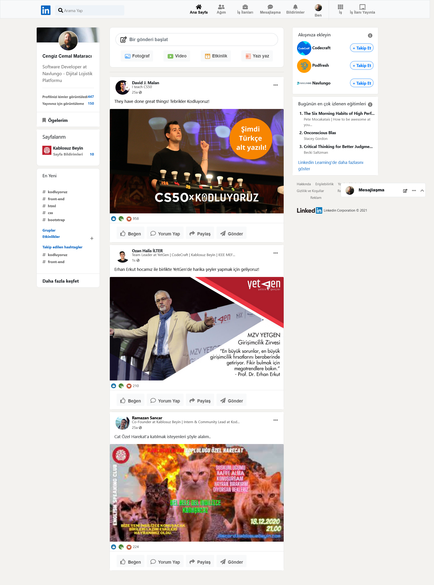

# www.patika.dev Bootstrap eğitiminin üçüncü ödevidir. Kodluyoruz tarafından hazırlanan LinkedIn klonunda yapılan değişiklikler düzeltildi.
## Mesajlaşma nav'ı ekran görüntüsünde yukarıda görünse de position-sticky olarak sağ alta sabitlenmiştir. 

# This is www.patika.dev Bootstrap training's third project. LinkedIn clone made by Kodluyoruz team had some irregularities, those were adjusted to get normal LinkedIn design.
## Nav "Mesajlaşma" looks at the middle of the page on screen shot, however in real it has position-sticky on bottom right. 

